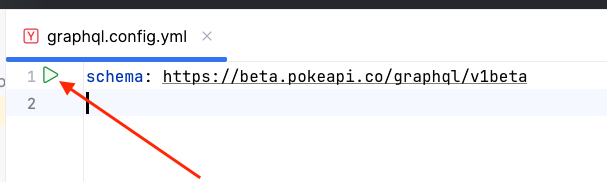

# Pokedex Explorer

## Website

https://hedgehogovich.github.io/pokedex-explorer/

## 💿 Installation

```bash
npm install
```
### Starting the Development Server

To start the development server with hot-reload, run the following command. The server will be accessible at [http://localhost:3000](http://localhost:3000):
```bash
npm run dev
```

To start the generation of types for the existing GraphQL queries, run the following command:
```bash
npm run gql-watch
```

### Building for Production
To build your project for production, use:
```bash
npm run build
```

### Idea IDE GraphQL queries syntax highlight
To help your IDE start highlighting the GraphQL queries syntax and add an autocompletion of your queries, go to the `graphql.config.yaml` file and click the following button:



## Possible improvements
- **Global**
  - improve the tree-shaking process:
    - use @mdi/js for Material Desing Icons in order to reduce redundant bundle size
    - remove usages of Vuetify's utility classes or clean them up using libraries like PurgeCSS
    - manually import Vuetify's components instead of using their global versions
  - add 404 and 500 error pages
  - add head metatags, a dynamic title and a description 
- **Main page**
  - fix the skeleton size in order to prevent layout shifts after the data finishes loading
  - make the header and the filter more compact, add a virtual scrolling block to the Pokemons' list
  - implement lazy load for the favourite Pokemons list
- **Details page**
  - create a loader skeleton for the page instead of the layout circular loader
